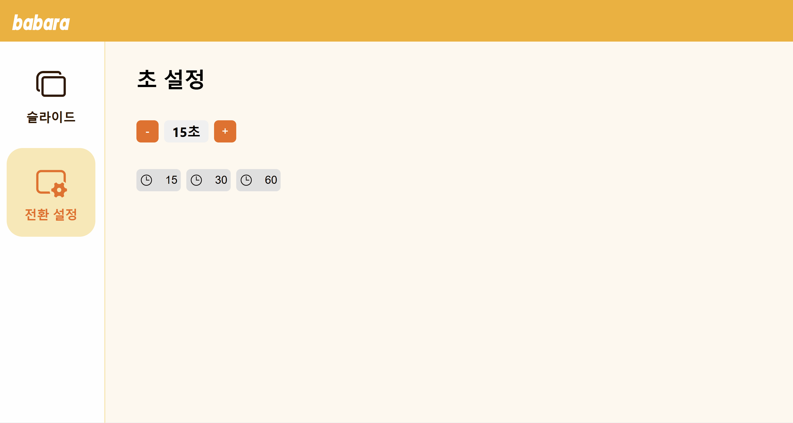

#  :smile: 소상공인을 위한 디지털사이니지 솔루션 - **babara**  :smile:

  

라즈베리파이를 활용한 초경량 사이니지 시스템인 **babara**는 소상공인을 위해 간편하고 효율적인 디지털 광고를 제공합니다.

---

## :mag: 기능 소개

### :open_file_folder: 이미지 관리

- 슬라이드에 표시될 이미지를 업로드할 수 있습니다.
- 드래그 앤 드롭으로 이미지 순서를 변경할 수 있습니다.
- 불필요한 이미지는 삭제가 가능합니다.

### :bookmark_tabs: 슬라이드 전환 시간 설정

- 슬라이드 전환 시간을 설정할 수 있으며, 기본 전환 시간은 15초입니다.
- `+`, `-` 버튼으로 전환 시간을 쉽게 조절할 수 있습니다.

---

## :green_book: 사용된 오픈소스

- 슬라이드 기능 :  [Swiper - The Most Modern Mobile Touch Slider](https://swiperjs.com/)
- 드래그 앤 드롭 :  [dnd kit – a modern drag and drop toolkit for React](https://dndkit.com/)

---

## :memo: 개발 환경

| 구성 요소      | 사용 기술                       |
|----------------|--------------------------------|
| **하드웨어**   | Raspberry Pi Zero 2            |
| **OS**         | FullPageOS                     |
| **프론트엔드** | React, styled-components       |
| **백엔드**     | Node.js, Express               |
